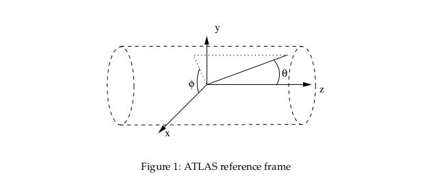

```{r setup, include=FALSE}
knitr::opts_chunk$set(echo = TRUE)

require(ggplot2)
require(lattice)
require(e1071)
require(caret)

library(pROC)
library(dplyr)
library(ranger)
set.seed(31415)
```

# Final Project

## Research Goal/Question

When two proton beams align, collisions of these protons produce elementary (subatomic) particles.

In addition to several other events, a Higgs Boson may be produced (a disturbance in the Higgs Field, related to the mass of particles). 
Moreover, in very special cases, the Higgs Boson may decay and produce a pair of another class of elementary subatomic particles, a pair of tau ($\tau$) leptons.  

The data below was simulated by the ATLAS experiment at CERN.  The primary goal of this project is to evaluate the usage of Random Decision Forests for selecting which primitive or derived values are important for determining if the observed products of a collision contain evidence of decay of the Higgs Boson into a tau-lepton pair (_signal_) or if the detected products were of another variety (_background_).


## Methodology

I will evaluate the usage of Random Decision Forests for variable selection and prediction. 

70 percent of a 300k observation sample of the original data set will be used for training, and evaluated using the remaining 30 percent as a test subset.

A Random Decision Forest will be generated, using 10-fold Cross Validation for choosing the optimum subset of variables to use for each decision tree.  The method inherently utilizes cross-validation internally when generating new trees at decision splits. 

Then, the important variables will be identified according to their mean decrease of Gini index (a measure of loss of prediction accuracy when the variable is not present in the tree), computed as an average across cross-validated trees.  We have elected to _not_ inspect the individual trees in the forest ensemble structure - this would take too much time and make this notebook far too long to read. 

Finally, the effectiveness of classification using the Random Forest as a model will be evaluated with the rate of true positive and negative classifications on the test subset.  

The development log and original source, plus a copy of the data set as when it was used, is available on GitHub at 

https://github.com/AnachronicNomad/introML_final-project

## Data

### Sources

The dataset used was accessed from the CERN Open Data Portal, and is simulated data from the ATLAS collaboration there.  

The data set can be directly accessed at the following link http://opendata.cern.ch/record/328.  This link also includes a handy breakdown of what each variable actually is (Atlas collaboration, 2014). 

The data was originally compiled for the Higgs Boson Machine Learning Challenge 2014 on Kaggle, and can be located at the following link https://www.kaggle.com/c/higgs-boson.

In general, I have elected to try and reduce particle physics knowledge needed for evaluating the usage of Random Decision Forests as a model itself, as the physics is not the primary goal of this project.  However, the page for the data, as well as the associated documentation (all of which is in the reference section), was immensely useful in understanding what each variable truly meant, how the variables were related, and what collinear or confounding factors to watch out for.  It's also important to make this note, because I do not have any expertise in high energy particle physics, and just wanted to explore it through a high-level statistical method that I hadn't used before or understood well. 

At this point, it's probably good to mention the disclaimer that comes along with every publication of data in the CERN Open Data Portal:

> Disclaimer
>
>The open data are released under the [Creative Commons CC0 waiver](https://creativecommons.org/publicdomain/zero/1.0/). Neither ATLAS nor CERN endorse any works, scientific or otherwise, produced using these data. All releases will have a unique DOI that you are requested to cite in any applications or publications. 

### Rationale

All of the variables in the data set are either "primitive" (```PRI_```, computed directly from observations by a detector), or "derived" (```DRI_```) from those primitive values.  From a statistics perspective, we then know that many of these variables are either collinear, or have non-linear relationships between themselves and the outcome.  This was part of the impetus behind choosing to use Random Decision Forests in order to approach this data set and associated problem. 

Some of the variables are related to whether or not a 'jet' (or multiples thereof) were produced during the collision.  However, for a vast majority of the data set, no jets were detected, and as a result the values for the associated jets was undefined.  There is no good way to include undefined values with this classifier, and so these variables have been left out.  What _has_ been kept are the total sum of momentum observed for all detected jets (```PRI_jet_all_pt```) and the number of jets produced (```PRI_jet_num```).  This may give us an indication of which perspective is more important to take - whether jets have been produced, or, accounting for the conservation of momentum in the products of the collision. 

> Show graph here of missing values. 

Next, a small number of the observations (approx 40k) are missing an estimated mass for the Higgs Boson candidate.  These observations have been filtered out -- if there was no Higgs Boson, how would it decay into a tautau pair?  Either way, an undefined value is difficult to use with our mthods, and it is currently a best practice at my level of concept mastery to avoid using them. 

Finally, there's some non-obvious jargon to unravel, best explored through a graphic Fig 1. - Atlas Reference Frame, courtesy of the documentation (Adam-Bourdarios, Cowan, Germain, Guyon, Kégl, Rousseau, 2014, pp. 7).



All phi ($\phi$) coordinates are angles within the $x-y$ plane.  All transverse quantities are projected onto the $x-y$ plane, and tend to occur within the same.  The pseudorapidity $\eta$ (eta) is a coordinate which is related to the direction along the $z$-axis that a particle is traveling, and is computed using the angle $\theta$. 

### Read Data

```{r}
raw_data = read.csv("./atlas-higgs-challenge-2014-v2.csv", sep=",", header=TRUE)
```

### Build and Filter Working Data

```{r}
# Build data frame of chosen predictors, all as numeric
data = data.frame("DER_mass_transverse_met_lep" = as.numeric(raw_data$DER_mass_transverse_met_lep),
                  "DER_mass_MMC" = as.numeric(raw_data$DER_mass_MMC), 
                  "DER_mass_vis" = as.numeric(raw_data$DER_mass_vis),
                  "DER_pt_h" = as.numeric(raw_data$DER_pt_h),
                  "DER_deltar_tau_lap" = as.numeric(raw_data$DER_deltar_tau_lep),
                  "DER_pt_tot" = as.numeric(raw_data$DER_pt_tot),
                  "DER_sum_pt" = as.numeric(raw_data$DER_sum_pt),
                  "DER_pt_ratio_lep_tau" = as.numeric(raw_data$DER_pt_ratio_lep_tau),
                  "DER_met_phi_centrality" = as.numeric(raw_data$DER_met_phi_centrality),
                  "PRI_tau_pt" = as.numeric(raw_data$PRI_tau_pt),
                  "PRI_tau_eta" = as.numeric(raw_data$PRI_tau_eta),
                  "PRI_tau_phi" = as.numeric(raw_data$PRI_tau_phi),
                  "PRI_lep_pt" = as.numeric(raw_data$PRI_lep_pt),
                  "PRI_lep_eta" = as.numeric(raw_data$PRI_lep_eta),
                  "PRI_lep_phi" = as.numeric(raw_data$PRI_lep_phi),
                  "PRI_met" = as.numeric(raw_data$PRI_met),
                  "PRI_met_phi" = as.numeric(raw_data$PRI_met_phi),
                  "PRI_met_sumet" = as.numeric(raw_data$PRI_met_sumet),
                  "PRI_jet_num" = as.numeric(raw_data$PRI_jet_num),
                  "PRI_jet_all_pt" = as.numeric(raw_data$PRI_jet_all_pt),
                  "Label" = as.factor(raw_data$Label)
)
```

#### Filter out observations which had null values

```{r}
# filter out observations which have No Value for the Higgs candidate mass
filtered = dplyr::filter(data, DER_mass_MMC > -999.0)

set.seed(31415)
# Use 300k of the observations to train and validate
sample_indx = sample(nrow(filtered), 
                     300000,
                     replace=F)
project_data = filtered[sample_indx,]
```

#### Training/Validation Split

```{r}
# Hold out 30% from training sample, build the training subset
num_val <- floor(nrow(project_data) * 0.3)  # Number held out for validation subset
num_train <- nrow(project_data) - num_val
training_indx <- sample(nrow(project_data), 
                        num_train, 
                        replace=F)

training <- project_data[training_indx,]
validation <- project_data[-training_indx,]
```

## Random Forest

### Rationale - Implementation Choices

Several choices were made in implementation. 

First, the ```caret``` package was used for its tangible training/test harness, training control mechanics, and verbose output for metrics regarding model performance.  

Next, the ```ranger``` package was used for access to its multi-core parallel implementation of Random Decision Forest which sped up the processing significantly compared to other implementations (Wright & Ziegler, 2017, pp. 8).  Furthermore, it actually provides an option for two different measures of variables importance:

1. Gini index of mean decrease in node impurity (when a variable is added to the model).  This index is a weighted measure of how often a given variable (feature) was used to split a node (i.e., make a decision at a boundary to generate further sub-trees). 

2. Subset permutation of observations throughout the different trees, and measure the magnitude of effect of different predictors by observing where the permuted subset of observations "ends up" after being run through the ensemble of trees. 

While subset permutation provides a solid probablistic argument for which features (variables) were important, and provides a stronger estimate of test error with the usage of the "Out-of-bag" error for the held out subset of the permuted observations for each tree, the Gini index was used instead for its consistentcy and wide canonical usage in the literature.  Furthermore, for our application of Random Decision Forests, the Gini index is a stronger measurement of variable importance - we have multiple variables whose values are derived in relationship to each other, and we want to know which of the derived or primitive values are of more use. 

Next, the standard 10-fold CV was used for variable selection, and 500 trees were grown.  Cross-Validation is used internally to each tree for the method for measuring the error and when making decision splits, but I was unable to verify what type of cross validation - simply that cross validation is in fact used. 

Finally, there is a non-standard usage for the size of the subset of predictors for each tree - one of which that is included is $\sqrt{p}$, where $p$ is the number of predictors being considered.  In many other implementations, such as ```randomForest```, this is the default size of the predictor subset which is used.  I'm unsure why, how, where or when this ends up being leveraged within the implementation - but the documentation for every package I have tried (```randomForest```, ```RBorist```, etc.) mentions this as the default for whenever a classification problem (as opposed to regression) is being implemented.  As a result, it has been included in order to maintain standardization and parity with the literature.

### Train The Model

10-Fold Cross Validation is used for parameter tuning, where a new forest is grown for each fold.  In this case, it is the number of randomly selected variables to hold in each tree in the forest.  

In an external attempt at tuning and training the model, the selection of variables from 1 to 13 was attempted.  
In order to build this document, this has been left out, and only 4 to 6 selected variables per each tree is used for illustration.  

```{r}
# training control
ctrl <- trainControl("repeatedcv",              # Do k-Folds CV to estimate error, tune parameters
                     number = 10,               # Do 5-fold CV to avoid melting the memory in my laptop
                     allowParallel = TRUE,      # If parallelized backend available, use it
                     classProbs = TRUE,         # Save the probabilities of each class, averaged from trees
                     verboseIter = TRUE         # Produce verbose output when training
                     #savePredictions = TRUE)
)

# Model Tuning Parameters
tgrid <- expand.grid(
  # Only choose 4,5,6 and sqrt(# predictors) for random subset of vars
  mtry = c(4, sqrt(ncol(project_data)), 5, 6),
  # Make sure to split trees according to node impurity
  splitrule = "gini",
  # Ensure each decision tree splits twice, and compare the two
  min.node.size = c(2)
)

set.seed(31415)
rf_model <- train(Label ~ .,                # Outcome: Label: {b,s}; as a response of all other predictors
                  data = training,          # Use the pre-specified training subset
                  method = "ranger",        # use `ranger' package implementation of Random Forest
                  importance = "impurity",  # Measure Gini Index of Node Impurity
                  num.trees = 500,          # Use standard 500 trees.
                  #save.memory = TRUE,       # Enable saving memory
                  tuneGrid = tgrid,         # Use specified tuning parameters
                  trControl = ctrl,         # Use training control specified earlier
                  verbose=T)                # Enable Verbose output for timing
```

### Which number of random subset of variables resulted in a higher accuracy rate?

```{r}
# Plot Accuracy vs the number of randomly selected predictors for each decision tree
plot(rf_model)
```

```{r}
# Print the best-accuracy number of randomly selected variables
# for each decision tree.
print(rf_model$bestTune$mtry)
```

Looks like we should be using 6 randomly selected variables for each predictor, as it maximizes the accuracy rate of prediction.

### Test the model on the validation subset

```{r}
# Use probabilities to find ROC curve and AUC metric
pred = predict(rf_model, newdata = validation, type="prob")

# Use raw for confusion matrix and importance measures
pred.1 = predict(rf_model, newdata = validation)
```

### AUC-ROC Curves

Below is an ROC Curve representing the accuracy of prediction for whether or not an event was a "signal" event.  The predicted possibilities of an event are used, which is why the curve appears so continuous and smooth. 

```{r}
# Build the ROC curve, use signal events as the positive class. 
result.roc = roc(validation$Label, pred$s)

# Plot the ROC curve for signal events, with identification of the best threshold.
plot(result.roc, print.thres="best", print.thres.best.method="closest.topleft")
```

Here, the grey line represents the "threshold" of a random guess, and the black curve represents our true positive prediction of whether something was a _signal_ event. 

Graphically, it looks like we're predicting _signal_ events pretty well! 

The "Receiver Operating Characteristic" (ROC) curve represents the ability of a model to classify a binary outcome, given variation in its discrimination threshold. 

Below are some metrics regarding the "Area under the Curve" (AUC), accuracy of prediction for signal events, and what threshold the accuracy needed to be above to be better than random chance. 

```{r}
print(auc(result.roc))
```

Typically, random chance is represented by an AUC of 0.5.  We can see here that the AUC of predicting a signal event is roughly 0.8893 on the test subset, so we're definitely picking up the signal.  However, this doesn't tell us exactly what the accuracy rate is, just that we're discriminating between background and signal events much better than random chance.  The following will address this. 

```{r}
result.coords = coords(result.roc, "best", best.method="closest.topleft", ret=c("threshold", "accuracy", "precision", "tpr", "tnr"), transpose=FALSE)
print(result.coords)
```

We observe that the optimum threshold to balance specificity and sensitivity is at coordinate 0.4005 on the curve, according to the ROC curve we generated.  This coordinate is the optimum threshold which balances the accuracy rate of classification for both background and signal events. 

The accuracy and precision at this optimum threshold is 0.807 and 0.726.  
The true positive (for this curve, _signal_ events) rate and true negative rate are roughly the same _at this optimum threshold_, approximately 0.811 and 0.812 respectively. 

What could we do in order to affect this?  We care more about increasing our accuracy rate of signal prediction, and we only identified the optimum threshold which balanced the true positive rate and the true negative rate.  At this point, we should identify that sensitivity is related to our true identification rate (specific to this curve, and not the remainder of this report) for classification of signal events.  According to the results from the ROC graph, we could adjust the threshold which counts as a "majority vote" from the Random Decision Forest ensemble, lowering our specificity (ability to predict background events, implying a drop in accuracy rate), but increasing our sensitivity and dramatically improving our ability to pick out signal events, which is what we want.  However, actually achieving this was beyond the scope of the initial project.  

To emphasize to move forward, these are measures of being able to discriminate between a background event and a signal event.  This hasn't told us how well the model actually performed on the validation set, just that based on the validation set, it will probably generalize well to a larger population data set. 

We need more in-depth information, so we need to look at the confusion matrix (of classification on the validation set) to get a better dig into what's going on. 

#### Confusion Matrix - True/False Positives on Validation Set

```{r}
confusionMatrix(pred.1, validation$Label)
```

Something important to note here is that the "positive" class is a background event.  If we're looking to determine how well the model is classifying signal events, we need to look at the "negative" class, for the above confusion matrix.  

Finally, the 95% CI doesn't make a lot of sense in this context.  We've only done 10-fold CV for each of the different number of selected subsets of predictors.  While Random Decision Forests internally do cross-validation in order to choose which decision tree to use, this is not the metric being provided. 

The "No Information Rate", or, the accuracy of random guesses based on the distribution, is 0.6103.  In order to be better than random guessing, the different prediction accuracies must be greater than this value.  At first glance, this is definitely the case, the overall accuracy rate is 0.815!  
The model is definitely classifying _something_ correctly!

Turns out it's a good thing we dug into the confusion matrix, because our True Positve Rate (for background) and True Negative Rate (for signal), are very different for our validation set. 

While our overall accuracy rate is 0.815, our accuracy rate for the classification of signal events (Neg Pred Value, above) is 0.7837.  This is definitely higher than the no information rate of 0.6103.  However, it's rather low for the ideal for a real world application - performing 0.1734 better than the No Information Rate certainly, but the rate indicates at least 1 out of every 5 signal events will be lost.  

The accuracy rate for determining if something is a background event is 0.8327.  This is definitely high relative to the No Information Rate, and indicates we are identifying background events extremely well - the model has clearly identified the values of the predictors which 


### Interpreting Accuracy and ROC

Overall, the model is discriminating well between the background and signal events.  The evidence for this was in the ROC curve, and the associated AUC metric, which was pretty good at around 0.89.  

However, the accuracy rate says that we are only predicting background events well, and we are not predicting signal events as well as the background events.  However, the accuracy rate of true identification for both is well above the No Information Rate, indicating that we have an okay classifier - maybe not the best, but gets the job done.  

We should take a quick detour to note that a significant number of predictors related to jets produced by a collision were left out of the model - these variables capture additional information about where the energy and mass ended up after a collision, and their removal may be a source of error, since not all the energy, momentum, and mass is being accounted for by the model.  This may have been the reason why there is such a large discrepancy in the true identification rate for background and signal events - there's probably something special occurring when a jet is produced, and you may need a certain energy/momentum/mass threshold to be crossed in order for the decay of the Higgs into a tautau pair in question to occur.

Overall, it appears the model does _okay_, it's not overwhelmingly good at prediction with a test accuracy rate of 0.815.  However, the metrics we have available to evaluate the model indicate that it performs relatively well enough for determining variable importance, and will be generalizeable to a much larger population. 


### Variable Importance measures

```{r}
varImp(rf_model)
```

When we trained the model, each decision tree in the forest was measured by the mean decrease in Gini Index.  The Gini Index is a weighted measure of how often a variable is used to split a node in the forest (i.e., a decision was made).  The other way to interpret this is a measure of the loss of linearity in a prediction when a variable is removed from a model.  

The above output measures the relative importance of the variables - each measure above is a percentage of the maximum decrease in node impurity (measured by the Gini index) when a variable is reintroduced to the model. 

It's important that the classifier was identified as being mostly accurate before using it for identifying important variables.  If the classifier ensemble was inaccurate, then the measures of importance we would find might be bunk. 

Before digging into what's printed above, we should remember that a collection of variables was used - some of whose variables were _derived_ from the others.  One of the goals of determining variable importance in this context is determining which was more important, the derived values which included extra information, or the original primitive values. 

Clearly, ```DER_mass_MMC``` is the most important variable (of all the variables used) for discriminating between whether an event was a background or signal event.  This derived measure is the estimated mass of the Higgs Boson that was produced by a collision.  

The variables which were at least 25% as important as the estimated mass of the Higgs Boson candidate, in decreasing order of importance, were:

> Note: fix the correct ordering of these variables after identifying issue with loading data with
> ```as.numeric```, pre poster presentation.  

* ```DER_mass_transverse_met_lep``` - The transverse mass between the missing transverse energy and the lepton.

* ```DER_mass_vis``` - The invariant mass of the hadronic tau and the lepton.

* ```PRI_tau_pt``` - The transverse momentum $\sqrt{p_x^2 + p_y^2}$ of the hadronic tau. 

* ```DER_deltar_tau_lep``` - The R separation between the hadronic tau and the lepton.  The R separation is a Euclidean distance between the angle in the transverse ($xy$-plane), and the direction of travel along the length of the collider torus $z$, $R = \sqrt{\eta^2 - \phi^2}$.

* ```DER_met_phi_centrality``` - The centrality of the azimuthal angle of the missing transverse energy vector w.r.t. the hadronic tau and the lepton.

* ```DER_pt_ratio_lep_tau``` - The ratio of the transverse momenta of the lepton and the hadronic tau.


Unsurprisingly, these all have to do with the interchange of mass and energy at subatomic and relativistic scales.  The most important variables are generally related to how much energy, momentum, or mass at a relativistic scale was observed or computed.  As a result, we need to apply some domain knowledge to make sense of what the important variables are.  

For example - ```DER_pt_ratio_lep_tau``` (23.44%) is a ratio of ```PRI_tau_pt``` (33.64%) and  ```PRI_lep_pt``` (13.90%).  Clearly, the signal determined by the ratio of the two momenta has a larger signal importance because of the importance it derives from the inclusion of the momentum of the hadronic tau.  The ratio itself may be important, but we need to keep these sort of things in mind.  In general, most of the variables follow this pattern - there are a number of primitive and derived variables of some importance, and the relationship of these requires examination.  Based on the hierarchy of the above, we could surmise that while the momentum of the lepton is only a little important, the momentum of the hadronic tau which is produced has a far greater impact on discriminating whether events of this class were of a background (this does have the higher accuracy rate of prediction) or signal variety.  It should be noted that the hadronic tau is not the same tautau pair which the Higgs is supposedly decaying into.  

However, there are some other interesting pieces that fall out - take for example the inclusion of ```DER_met_phi_centrality``` and ```DER_deltar_tau_lep```.  These derived values are of significantly greater importance than their related primitive values, and are worthy of more scrutiny.  There's far more information captured by these composite values, and provides indication that the expression providing that compositive value is probably of significance for the theoretical model.  For example, the centrality of the azimuthal angle of the missing transverse energy (```DER_met_phi_centrality```) scores significantly high at 25.91, but the corresponding angle is barely of importance at all (```PRI_met_phi```, 12.93%). 

In particular, it is interesting that the R separation of the hadronic tau and the lepton associated with the event (```DER_deltar_tau_lep```) has such a high importance relative to everything else - this distance between the two is computed using the difference of the pseudorapidity ($\eta$) and azimuthal angle $\phi$ of the two particles (Adam-Bourdarios, Cowan, Germain, Guyon, Kégl, Rousseau, 2014, Appendix A.3).  The high importance of this derived value, compared to the two primitive variables, may speak to the angle of the collision, and determining something special about what collisions occurred to produce such an event. 

Next, we can also see that the number of jets produced had zero impact or importance on the outcome - values associated with those jets may have an influence (such as the sum of momentum of all jets produced, ```PRI_jet_all_pt```).  However, values for angles of detection, momentum, and energy of jets were not included in the classification because of the difficulty associated with including "undefined" values within the classification itself, as noted in the Data section.  Each jet is a pseudo-particle interpretation of collimated energy, interpreted as a wavefront, as it struck a detector on the outside of the torus.  Discussion with subject matter experts indicated that what jets were produced is of critical importance for the Higgs, 

There's something which has been left out here which may turn out to be important - the ability to inspect each tree, and each node.  If we took the time and space, it would be possible to view each node, and each associated split tree.  This would give us the ability to see the chain of variables which split the ensemble - that is, identify multiple classes or the importance of each variable in relation to each other.  This would provide state-dependent information about each of the variables, for example, if we classify according to the transverse mass between the missing transverse energy and the lepton, we might want to next make a decision based on the momentum of the lepton, and inspecting the forest/ensemble structure would give us this information.  Furthermore, vieweing the depth of the trees as generated may provide insight about distinct classes of outcomes which could be gleaned from this data set, instead of just categorizing events into something that should or shouldn't be looked at. 

Finally, the combination of multiple collinear variables which capture some of the same information appear to have roughly the same importance scores.  There may also be non-linear effects which are captured by groupings of the variables, but aren't easily visible using these metrics or this model - however, the usage of the model provided additional evidence that these groupings of variables exist, and a composite feature may be of more use.  For future steps, it may be useful to use a hierarchical clustering classifier to observe the same effects, or employ principal components in order to view this.  


## Evaluation

### Prediction

We found that Random Decision Forests did reasonably well at prediction.  The model as built on the training subset and validated on a held-out subset had an ROC curve and associated AUC metric that indicated the model would generalize well to a larger population.  However, the metrics for true identification of background or signal classification were not as promising.  When validated on a held-out subset, the model had a tendency to predict background events _okay_, and did worse at predicting signal events, performing just on this side of passably well.  Yet, the accuracy rate of the true classification of both signal and background events was high enough to move on to the next stage, identifying variable importance. 

However, due to the nature of the method being used, predictors which may have been significant have been left out.  There was no good way to handle the undefined values resulting from whether or not a jet was present - there may have been import information for the signal present in these values, but they weren't present.  This may have resulted in a discrepancy in the identification rate for background and signal events.  

### Variable Importance

The variable importance measures gained from Random Forest provided insight into the data, and matched information known from theoretical models.  The method correctly identified that variables related to mass, momentum, and energy levels were the most important in determining what products form from a hadronic collision, decayed or otherwise - mass, momentum and energy must be conserved in one way or another.  This also helps solidfy my own understanding and underscores the utility of Random Decision Forests, when applied to a data set with unknowns, it does find things which are externally testable and confirmable. 

Moreover, the variable importance measures available with Random Decision Forests identified several key features and provided a hierarchy for understanding what was important or not - even when the features have non-linear relationships, or have direct collinearity between them (which would otherwise make it difficult to determine which predictor was "more important").  This is not directly possible with many of the methods we covered in class, and is a unique addition to "the toolbox" beyond best-subset selection or interpreting coefficients from the usual regression. 

However, this usage of the model "puts the cart before the horse" in some ways - one of the key things which became evident from the variable importance scores were the "groupings" of variables in relation to the outcome.  Where Random Decision Forests end up giving somewhat related variables similar Gini index scores, it begins to make more sense to group features together into composite features, such as using Principal Components, which may result in a higher accuracy rate at the expense of interpreting variable importance.  It also would have been significantly faster to first explore the data using an unsupervised method, identify these issues and relative distance for each predictor, then decide on whether to use Random Decision Forests. 

Finally, as mentioned repeatedly, potentially important information had to be left out due to the nature of the method.  The inability of a supervised method like this to handle when a variable becomes undefined poses an issue for exploring large data sets - however, it's difficult to determine variable importance with an unsupervised method in the first place, so this limitation just needs to be noted when using Random Decision Forests.  

### Real-World Implementation/Usage

Random Decision Forests in high-dimensional spaces with thousands of observations requires intense computational power, especially for high-dimensional problems.  There was extensive searching for, and reading of, documentation required to find, use, and compare suitable implementations for performing the Random Decision Forests problem.  Thankfully, I landed on the ```ranger``` package, a relatively recent addition to the host of packages which implement Random Decision Forests in R, and which was by far the fastest implementation to use (Wright & Ziegler, 2017, pp. 8) and deploy.  

The runtime for the code as used above was in the ballpark of 2-5 hours on a conventional business laptop with a mid-grade 2017 Intel i7 processor clocked at 2.5 GHz and 12GiB of 1666 MHz RAM, and I barely had enough RAM left to watch movies in the background while it ran.  The author, at one point, drove a truck through a snowstorm to a friend's server with a 16 core Ryzen 2 processor clocked at 3.4 GHz, with 32 GiB of ECC RAM clocking in at 2666 MHz.  The same code was run, except the subset of variables used for each tree was tested from 2 to 13.  That took over 6 hours to run, and the temperature inside the room housing the server remained at roughly 30 degrees Celsius for up to two hours after the computation finished, depite cold air from a blizzard being vented directly into the room.  In both cases, somewhere between 9 to 12 GiB of RAM needed to be held in memory while the ensemble forest was being grown.  

Where methods such as regression and other techniques are accomplishable with a real solid beer or two, Random Decision Forests ended up being much more intense - the author's suggestion is to acquire boxed wine, friends, and cheese and crackers of choice.  The author found most the best success with the leverage of lightly toasted brie and goat cheese, with a multiple berry preserve or jam, applied to a Ritz cracker. 

In general, this method is employable when there has already been significant non-trivial work done on verifying and cleaning the data prior to use.  Significant prior thought needs to be put into how the problem is being addressed and constructed prior to the application of Random Decision Forests - in short time spans, the user may not have reasonable ability to run the model more than once, due to the intensive computational expense, before moving on to interpreting the model output. 

## Acknowledgements

Special thanks to:

* Audrey Hendricks for shepherding the iterative process for developing the foundations for beginning this project

* Amy Roberts and Anthony Villano for providing context and understanding of the core components of the data I was working with

## References

ATLAS collaboration (2014). Dataset from the ATLAS Higgs Boson Machine Learning Challenge 2014. CERN Open Data Portal. DOI:10.7483/OPENDATA.ATLAS.ZBP2.M5T8 
Accessed at http://opendata.cern.ch/record/328 on 16 Nov 2019

Adam-Bourdarios, Claire; Cowan, Glen; Germain, Cecile; Guyon, Isabelle; Kégl, Balázs; Rousseau, David; (2014). Learning to discover: the Higgs boson machine learning challenge - Documentation. CERN Open Data Portal. DOI:10.7483/OPENDATA.ATLAS.MQ5J.GHXA 
Accessed at http://opendata.cern.ch/record/329 on 17 Nov 2019

Wright, Marvin N., and Andreas Ziegler. “Ranger: A Fast Implementation of Random Forests for High Dimensional Data in C++ and R.” Journal of Statistical Software, vol. 77, no. 1, Mar. 2017, doi:10.18637/jss.v077.i01.
Accessed on the Arkiv on 20 Nov 2019


<br>

<br>

<br>


